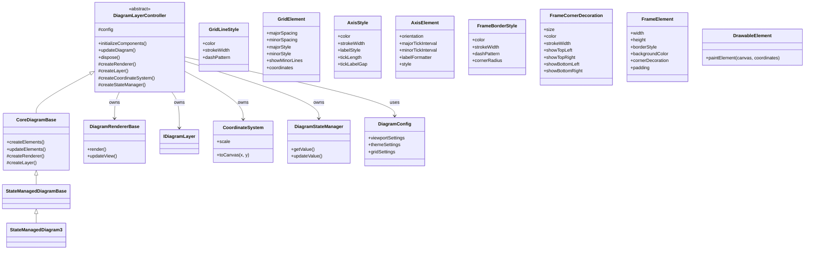

# Proposed Hierarchy Improvement

## Current Hierarchy


## Proposed Hierarchy


## Key Benefits

1. **Clear Ownership**: DiagramLayerController owns and coordinates all core components:
   - DiagramRendererBase (rendering)
   - IDiagramLayer (element management)
   - CoordinateSystem (coordinate transformations)
   - DiagramStateManager (state management)

2. **Separation of Concerns**:
   - Controller handles coordination and lifecycle
   - Renderer focuses purely on rendering
   - Core diagram base handles diagram-specific functionality
   - State management is properly coordinated at the top level

3. **Simplified Dependencies**:
   - Components don't need to know about each other
   - All coordination happens through the controller
   - Cleaner interfaces between components

4. **Flexibility**:
   - Easier to swap out individual components
   - Different diagram types can customize behavior while maintaining structure
   - New features can be added at appropriate levels of abstraction

## Implementation Notes

### DiagramLayerController Interface
```dart
abstract class DiagramLayerController {
  // Component initialization and lifecycle
  void initializeComponents();
  void dispose();
  
  // Core operations
  void updateDiagram();
  void invalidateView();
  
  // Component access (protected)
  DiagramRendererBase get renderer;
  IDiagramLayer get layer;
  CoordinateSystem get coordinates;
  DiagramStateManager get stateManager;
  
  // Optional overrides for customization
  void onStateChanged();
  void onElementsUpdated();
}
```

### Typical Flow of Operations
1. Initialization:
   ```dart
   void initializeComponents() {
     _renderer = createRenderer();
     _layer = createLayer();
     _coordinates = createCoordinateSystem();
     _stateManager = createStateManager();
     
     // Wire up components
     _stateManager.addListener(onStateChanged);
     _layer.addListener(onElementsUpdated);
   }
   ```

2. Update Flow:
   ```dart
   void updateDiagram() {
     // State changes flow down through components
     stateManager.processUpdates();
     
     // Layer updates based on state
     layer.updateElements();
     
     // Renderer reflects changes
     renderer.updateView();
   }
   ```

3. Component Coordination:
   ```dart
   void onStateChanged() {
     // State changes can trigger element updates
     layer.handleStateChange(stateManager.currentState);
     
     // Update coordinate system if needed
     coordinates.updateTransform(stateManager.viewportState);
     
     // Trigger re-render
     invalidateView();
   }
   ```

This maintains the existing inheritance chain while adding proper coordination at the top level. The controller provides a clean interface for managing all components while keeping their interactions organized and predictable.

### Component Creation and Configuration

The controller would provide factory methods for component creation, allowing derived classes to customize components while maintaining the coordination structure:

```dart
abstract class DiagramLayerController {
  // ... previous interface methods ...

  // Protected factory methods
  protected DiagramRendererBase createRenderer();
  protected IDiagramLayer createLayer();
  protected CoordinateSystem createCoordinateSystem();
  protected DiagramStateManager createStateManager();
  
  // Configuration
  protected DiagramConfig get config;
  protected void updateConfig(DiagramConfig newConfig);
}
```

Example implementation in CoreDiagramBase:
```dart
class CoreDiagramBase extends DiagramLayerController {
  @override
  DiagramRendererBase createRenderer() {
    return CustomPaintRenderer(
      config: config,
      coordinateSystem: coordinates
    );
  }

  @override
  IDiagramLayer createLayer() {
    return BasicDiagramLayer(
      config: config,
      stateManager: stateManager
    );
  }

  // ... other factory implementations ...
}
```

### Key Implementation Benefits
1. **Clear Component Lifecycle**: Each component's lifecycle is managed consistently through the controller
2. **Predictable Update Flow**: Changes flow through the system in a controlled manner
3. **Flexible Extension Points**: Derived classes can customize behavior by overriding specific methods
4. **Encapsulated Coordination**: Components remain focused on their specific responsibilities
5. **Configurable Creation**: Components can be customized while maintaining coordination structure
6. **Clean Factory Pattern**: Factory methods provide clear points for extending functionality

## Migration Strategy

### Phase 1: Introduce Controller
1. Create DiagramLayerController as an abstract class
2. Move component creation to factory methods
3. Keep existing inheritance chain temporarily
4. Add controller interface methods without full implementation

```dart
// Step 1: Create controller
abstract class DiagramLayerController {
  // Define interface but don't enforce implementation yet
  void initializeComponents() {}
  void updateDiagram() {}
  // ...
}

// Step 2: Add to hierarchy without breaking changes
class DiagramRendererBase extends DiagramLayerController {
  // Existing implementation remains unchanged
}
```

### Phase 2: Migrate Component Creation
1. Move component instantiation to factory methods
2. Update existing classes to use factory methods
3. Keep backward compatibility during transition

```dart
// Step 3: Implement factory methods
class CoreDiagramBase extends DiagramRendererBase {
  @override
  protected DiagramRendererBase createRenderer() {
    // Move existing creation logic here
    return super.createRenderer();  // Temporary during migration
  }
}
```

### Phase 3: Complete Implementation
1. Make DiagramLayerController methods abstract
2. Remove temporary compatibility code
3. Update all derived classes to proper implementation
4. Reorganize inheritance chain to final structure

```dart
// Step 4: Final implementation
abstract class DiagramLayerController {
  // Now enforce implementation
  abstract void initializeComponents();
  abstract void updateDiagram();
  // ...
}

class CoreDiagramBase extends DiagramLayerController {
  // Full implementation of controller interface
}
```

### Migration Benefits
1. **Gradual Transition**: Changes can be made incrementally
2. **Backward Compatibility**: Existing code continues to work during migration
3. **Testable Steps**: Each phase can be tested independently
4. **Minimal Disruption**: Existing diagrams continue to function during migration
